<p align="center">
  <a href="#">
    <picture>
      <source media="(prefers-color-scheme: dark)" srcset="https://capsule-render.vercel.app/api?type=waving&height=200&color=gradient&customColorList=0&text=SYNCRO&fontSize=80&fontColor=d4a853&reversal=false&section=header">
      
    </picture>
  </a>
</p>

<p align="center">
  <b>Смотрите видео вместе. Фильмы, сериалы, YouTube — в реальном времени.</b><br>
  <sub>С E2E-шифрованием и синхронизацией как в RAVE</sub>
</p>

<p align="center">
  <a href="https://github.com/nedzi/syncro/blob/main/LICENSE">
    
  </a>
  
  
  
  
  
  
  
</p>

<br>

---

## ✦ Возможности

<table>
<tr>
<td width="50%">

###Совместный просмотр
Создавайте приватные комнаты и смотрите кино с друзьями в реальном времени. Play/Pause/Seek синхронизируются мгновенно.

###E2E-шифрование
Все события синхронизации шифруются AES-256-GCM на клиенте. Пароль комнаты — ключ. Сервер ничего не знает о том, что вы смотрите.

###P2P-шаринг
Делитесь локальными файлами напрямую между участниками через WebRTC (PeerJS). Без загрузки на сервер.

</td>
<td width="50%">

###Каталог фильмов
Поиск по Кинопоиску и TMDB. Фильтрация по жанрам, годам, рейтингу. Встроенный поиск торрентов и прямых ссылок.

###Любой источник
YouTube, VK Video, .mp4, .m3u8 (HLS) — вставьте ссылку и смотрите вместе. `yt-dlp` достанет лучший доступный формат.

</td>
</tr>
</table>

<br>

## ✦ Скриншоты

<p align="center">
  <i>Скоро здесь будут скриншоты приложения</i>
</p>

<!-- TODO: add screenshots
<p align="center">
  
  
  
</p>
-->

<br>

## ✦ Архитектура

```mermaid
flowchart TB
    subgraph Frontend ["💻 Frontend (Next.js 16)"]
        direction TB
        MC["🎬 Movie Catalog"] --> RM["🔑 Room Manager"]
        RM --> SP["▶️ SyncPlayer<br>(HLS + WebTorr.)"]
        
        RM --> CL["🔒 Crypto Layer<br>(AES-256-GCM + PBKDF2)"]
        SP --> CL
        
        CL --> SC["🔌 Socket.IO Client + PeerJS"]
    end

    subgraph Backend ["⚙️ Backend (Express + Socket.IO)"]
        direction TB
        RA["🌐 REST API<br>(TMDB/KP/yt)"]
        SR["🔄 Socket Relay<br>(sync, signaling)"]
        RS[("💾 Room Store<br>(in-memory)")]
        
        SR <--> RS
    end

    SC ====>|⚡ encrypted sync events| SR

    %% Стилизация блоков для красоты
    style Frontend fill:#1a1b26,stroke:#7aa2f7,stroke-width:2px,color:#fff
    style Backend fill:#1a1b26,stroke:#f7768e,stroke-width:2px,color:#fff
    style CL fill:#24283b,stroke:#e0af68,stroke-width:1px
    style SC fill:#24283b,stroke:#73daca,stroke-width:1px
    style SR fill:#24283b,stroke:#bb9af7,stroke-width:1px
```



<br>

## ✦ Технологии

<p align="center">
  
  
  
  
  
  
  
  
  
  
  
  
</p>

| Frontend | Backend |
|---|---|
| Next.js 16 (App Router) | Express + TypeScript |
| React 19 | Socket.IO |
| Tailwind CSS v4 | yt-dlp (youtube-dl-exec) |
| Framer Motion | Axios |
| PeerJS (WebRTC) | Cheerio |
| WebTorrent | — |
| HLS.js | — |

<br>

## ✦ Быстрый старт

### Предварительно

- Node.js v18+
- npm / pnpm / yarn
- Windows: `yt-dlp.exe` в `backend/` (для извлечения медиа-ссылок)

### Backend

```bash
cd backend
cp .env.example .env
# Отредактируйте .env — добавьте TMDB_API_KEY при необходимости
npm install
npm run dev
# → http://localhost:3001
```

### Frontend

```bash
cd frontend
cp .env.local.example .env.local
npm install
npm run dev
# → http://localhost:3000
```

### Переменные окружения

<details>
<summary><b>Backend (<code>backend/.env</code>)</b></summary>

| Переменная | По умолчанию | Описание |
|---|---|---|
| `PORT` | `3001` | Порт сервера |
| `CORS_ORIGIN` | `http://localhost:3000` | Разрешённый CORS-источник |
| `TMDB_API_KEY` | — | API-ключ TMDB |
| `KINOPOISK_API_KEY` | встроенный fallback | API-ключ Кинопоиска |
| `TORRENT_PROVIDER` | `both` | Предпочитаемый источник торрентов |

</details>

<details>
<summary><b>Frontend (<code>frontend/.env.local</code>)</b></summary>

| Переменная | По умолчанию | Описание |
|---|---|---|
| `NEXT_PUBLIC_API_URL` | `http://localhost:3001` | URL бэкенда (REST) |
| `NEXT_PUBLIC_SOCKET_URL` | `http://localhost:3001` | URL бэкенда (Socket.IO) |

</details>

<br>

## ✦ API Endpoints

<details>
<summary><b>REST API</b></summary>

| Метод | Путь | Описание |
|---|---|---|
| `GET` | `/ping` | Health check |
| `GET` | `/api/catalog/discover` | Каталог (Кинопоиск) |
| `GET` | `/api/catalog/search` | Поиск (Кинопоиск) |
| `GET` | `/api/catalog/movie/:id` | Детали фильма (Кинопоиск) |
| `GET` | `/api/tmdb/discover` | Каталог (TMDB) |
| `GET` | `/api/tmdb/search` | Поиск (TMDB) |
| `GET` | `/api/tmdb/movie/:id` | Детали фильма (TMDB) |
| `GET` | `/api/tmdb/genres` | Жанры (TMDB) |
| `GET` | `/api/torrents/search` | Поиск торрентов |
| `GET` | `/api/torrents/extract-url` | Извлечение видео-ссылки |
| `GET` | `/api/torrents/extract-formats` | Список форматов |
| `GET` | `/api/torrents/room-stream` | Поток комнаты |
| `POST` | `/api/torrents/select-quality` | Сменить качество |

</details>

<details>
<summary><b>Socket.IO Events</b></summary>

**Client → Server:** `create_room`, `join_room`, `leave_room`, `sync_encrypted`, `bootstrap_encrypted`, `webrtc_signal`, `p2p_peer_ready`

**Server → Client:** `init_data`, `rooms_list_update`, `room_created`, `join_ok`, `join_denied`, `room_error`, `room_users`, `user_joined`, `sync_encrypted`, `bootstrap_encrypted`, `webrtc_signal`, `p2p_peer_ready`

</details>

<br>

## ✦ Лицензия

MIT © [nedzi](https://github.com/nedzi)

---

<p align="center">
  <sub>Built with ❤️ by <a href="https://github.com/nedzi">nedzi</a></sub>
</p>
